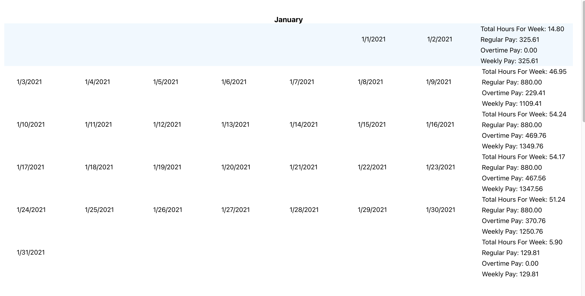
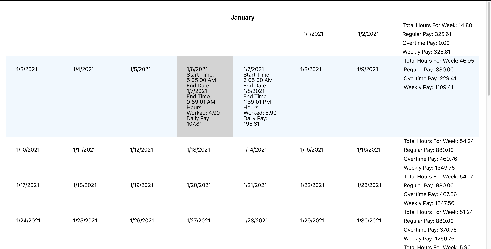

# Welcome to my Haul Take Home project!

## Setup
Clone this repo onto your local machine, once there run npm install to install dependencies (may need to delete package-lock.json)
running npm start will start the app in development mode and should open a tab in your browser

### Instructions

Hovering over a week will highlight the entire row, hovering over day will highlight that day in gray.

Click on a day to get all of the driver's information for that day.

On the right is the week's summary and any warnings if needed.
